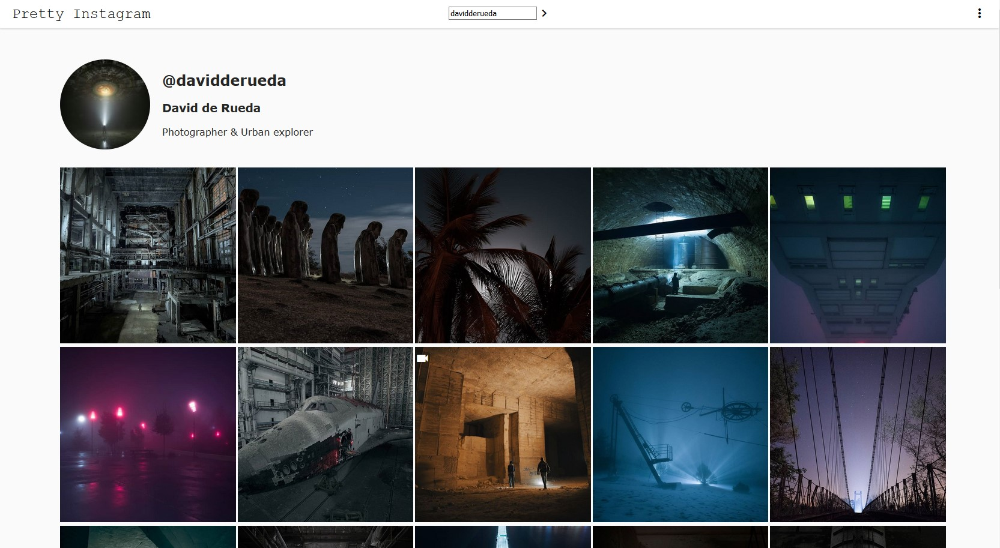

# pretty-instagram

a simple node.js web page that display the latest posts of your Friends.

If you have a suggestion to improve pretty-instagram, I invite you to open an issue post or/and fork and open a pull request.

Photo credit by [davidderueda](https://www.instagram.com/davidderueda/)

## Feature

* Admire your friends' instagram posts without any disturbing interactions (likes, comments, etc.) to stay focused on the essential.
* *Lazy Loader* - all posts you don't see on your screen will never load on your device.
* See posts in fullscreen.

## Install

Choose or create an empty folder before continue and select it on Terminal with `cd /path/folder_name`, then place .package-lock in the folder

### Dependencies

`npm i express dotenv serve-favicon body-parser instagram-web-api compression` to install all dependencies.

**The instagram-web-api dependencies on npm is outdated**, install it on npm to install his dependencies, then remove the instagram-web-api/ folder in node_modules/ and install the last version from github by using git:
`git clone https://github.com/jlobos/instagram-web-api`

### Installation

- After you have installed all dependencies, put `server.js`, `.env` and `public/` in your folder.
- Edit `.env` file:  YOUR_USERNAME by your instagram username and YOUR_PASSWORD by your instagram password
- start the server with: `node server.js`

I recommand you to use `screen` to be able to continue to use the server in background

## Licences

The repositories and all files insides, are available under the MIT licences

## Contact

You can contact me at [quentin3157.github@gmail.com](mailto:quentin3157.github@gmail.com).
