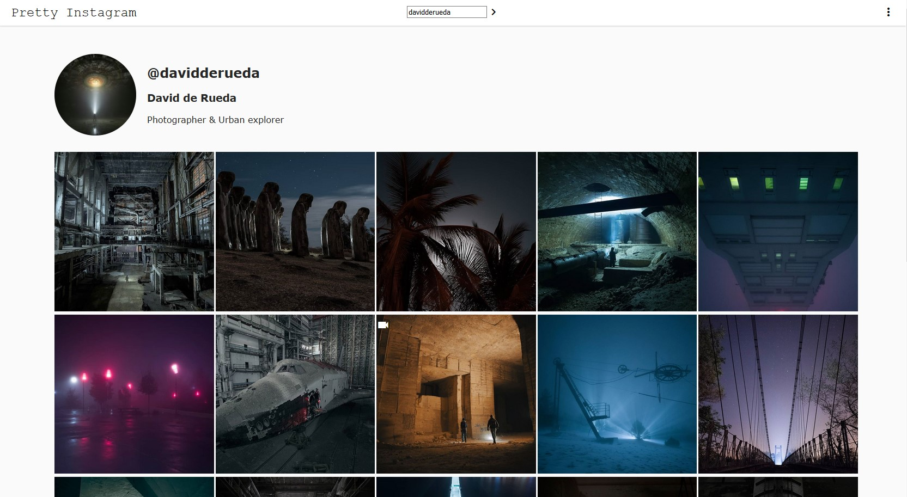

# Pretty-Instagram

[go here](http://skull-pixel.fr:3000/) to see a preview of the online last commit or unstable changes.

a simple node.js web page that display the latest posts of your Friends.

If you have a suggestion to improve Pretty-Instagram, I invite you to open an issue post or/and fork and open a pull request.

Photo credit by [davidderueda](https://www.instagram.com/davidderueda/)

## Feature

* Admire your friends' instagram posts without any disturbing interactions (likes, comments, etc.) to stay focused on the essential.
* *Lazy Loader* - all posts you don't see on your screen will never load on your device.
* See posts in fullscreen.

## Licences

The repositories and all files insides, are available under the MIT licences

## Contact

You can contact me at [quentin3157.github@gmail.com](mailto:quentin3157.github@gmail.com).
